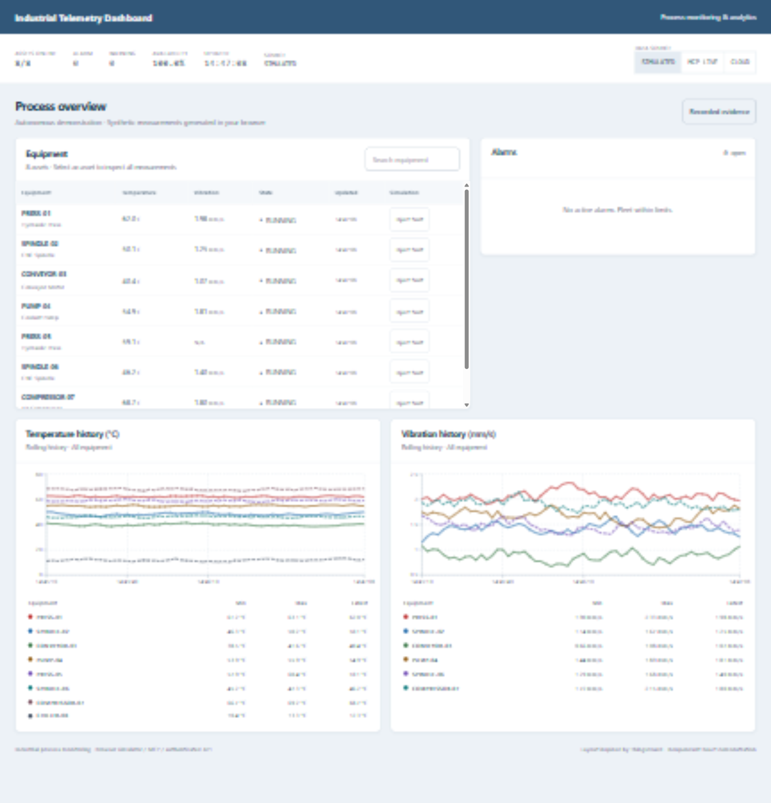
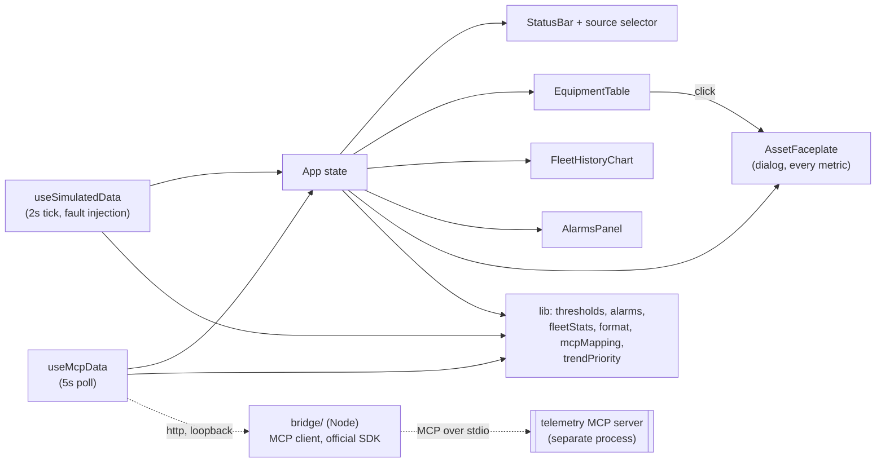

# Industrial Telemetry Dashboard

**Public industrial workspace:** the [interactive demo](https://younes-alaoui-ismaili.github.io/Industrial-telemetry-dashboard/) now presents a searchable equipment table, alarms and fleet temperature/vibration history. The simulator runs entirely in the browser and does not require Azure, a ThingsBoard server or sign-in. Data is synthetic and labelled on screen.

[Watch the real Azure proof](https://younes-alaoui-ismaili.github.io/Industrial-telemetry-dashboard/azure-proof.webm?v=azure-20260920): a 45.72-second English recording of the new frontend on Azure App Service. It shows SQL-backed graphs, PRESS-01 overheating, an authenticated Operator acknowledgement, recovery and reload. The finite publisher wrote 360 synthetic measurements. Separate Operator and Reader reads confirm the saved acknowledgement; the Reader write attempt is refused with 403. [Verification and recording provenance](evidence/azure/azure-frontend-20260920.json).

[Watch the current front-end demonstration](https://younes-alaoui-ismaili.github.io/Industrial-telemetry-dashboard/frontend-demo.webm?v=scenario-en-20260920): a 30-second operator scenario with graphs visible from the first frame. Follow PRESS-01 through simulated overheating, threshold inspection, acknowledgement while active and return to normal. Real browser captures from the public demo, English captions, marked x3/x4 acceleration and normal-speed inspection. Synthetic browser data only; no Azure, SQL or authenticated operator role. [Recording provenance](evidence/local/frontend-scenario-20260920.json).

**Local ThingsBoard edition:** a native ThingsBoard dashboard with equipment, temperature/vibration history and imported Azure alarm states is available through the [local installation and operating guide](infra/thingsboard/README.md). It uses a retained copy of synthetic Azure measurements with original timestamps; it does not require continuous Azure polling or replace the public React demo.

[Watch the local ThingsBoard walkthrough](evidence/local/thingsboard-walkthrough-20260920.webm): equipment overview, temperature and vibration peaks, and alarm details. Silent browser capture, about 59 seconds, with idle gaps shortened. Historical synthetic data copied from Azure; no live cloud acquisition or alarm acknowledgement in this recording. [Recording provenance](evidence/local/thingsboard-walkthrough-20260920.json).

[Watch the recorded Azure walkthrough](evidence/azure/cloud-browser-20260919.webm): authenticated cloud data, alarm acknowledgement and reload. Synthetic measurements, personal demonstration; [verification and limitations](evidence/azure/README.md).

**Persistent API extension:** SQL history, server-owned alarms, Reader/Operator access and a third Cloud source are documented in [the local setup](docs/persistent-telemetry.md). [Actual Azure acceptance evidence](evidence/azure/README.md) covers authenticated SQL access, persistent acknowledgement, restart, rollback, a temporary SQL access incident and export/import recovery. [Azure operations](docs/azure-operations.md) provides reproduction procedures. The public demo below uses the simulator; the Azure proof is a separate, access-controlled personal demonstration. [Local recordings](evidence/README.md) remain available and are labelled as local.

> A supervision screen for a fleet of industrial machines: live readings against operating limits, threshold driven alarms with a real lifecycle, and a self contained data simulator so it runs with one command.

[](https://github.com/Younes-Alaoui-Ismaili/Industrial-telemetry-dashboard/actions/workflows/ci.yml)


**[Live demo](https://younes-alaoui-ismaili.github.io/Industrial-telemetry-dashboard/)**

[Earlier interface walkthrough](docs/demo.gif): archived recording of the original dark interface and simulator alarm lifecycle. The current public layout is shown above.

Eight machines report temperature, vibration, pressure, speed and cycle counts. Every reading is compared against its own warning and alarm limits, and any crossing raises an alarm that tracks its own peak, duration and acknowledgement state. An **Inject fault** control on each machine drives a metric past its limit on demand, so the whole path from healthy fleet to raised alarm to acknowledgement can be demonstrated in about a minute.

## Data sources

A selector in the header chooses where the readings come from.

- **Azure proof** opens the real Azure recording described above. **Frontend demo** opens the separate browser-simulator walkthrough. These are two labelled recordings, not a live cloud connection from GitHub Pages. On Azure or a local API deployment, the Cloud radio selects the authenticated persistent API. [Setup and limits](docs/persistent-telemetry.md).
- **Simulated** (default). The built in simulator. Nothing to install, nothing to configure, and it is what the live demo above runs on.
- **MCP live**. Real readings from a telemetry [MCP](https://modelcontextprotocol.io) server, reached through a small local bridge. The dashboard calls the server's own tools: `list_devices`, `get_telemetry`, `get_anomalies` and `simulate_fault`. Alarms in this mode are the ones the server detected, carrying the threshold the server itself crossed. Injecting a fault sends `simulate_fault` to the server and the readings move because the server moved them.

> **MCP live works from a local build, as a condition of use.** The demo page is served over `https`, and a page served over `https` is not allowed to call `http://localhost`; that is browser mixed content policy. Selecting **MCP live** on the published demo therefore opens a short connect guide, describes the local setup in three steps, and leaves the simulator in charge. To see the live mode work, clone the repository and run it locally.

### Honest labelling

Picking the live source probes the bridge first, and the source only switches when the bridge answers; until then the dashboard is labelled simulated because it is. A live session that later loses its bridge does not pretend either: a banner reads `MCP LINK LOST`, states in words that what is on screen is simulated, keeps polling for the bridge to come back, and the header source shows `SIMULATED (FALLBACK)`. Simulated readings are never presented as live ones.

### Running the live mode

The bridge is a separate Node package in `bridge/`. It speaks MCP over stdio to the telemetry server using the official [`@modelcontextprotocol/sdk`](https://github.com/modelcontextprotocol/typescript-sdk), and exposes what it gets on loopback so the browser can read it.

```bash
cd bridge
npm ci
cp .env.example .env      # then point TELEMETRY_MCP_ARGS at your telemetry server
node --env-file=.env src/index.js
```

The bridge refuses to start without `TELEMETRY_MCP_COMMAND`, rather than guessing a path and reporting a connection failure that is really a configuration failure. The bridge reads machine-specific paths from its ignored local environment file.

With the bridge running, start the dashboard as usual and pick **MCP live** in the header.

## Design

The public React workspace adapts the organization of the [ThingsBoard thermostat dashboard](https://github.com/thingsboard/thingsboard/blob/v4.3.1.5/application/src/main/data/json/demo/dashboards/thermostats.json): blue masthead, light surfaces, equipment and alarms above fleet history. It is an independent React implementation. The native ThingsBoard edition and its Apache-2.0 template remain separately documented in [infra/thingsboard](infra/thingsboard/README.md).

- Search equipment by tag or name, then open its complete measurement faceplate.
- Compare temperature and vibration across equipment with labelled series and min/max/latest statistics. Lines connect successive available samples; no zero samples are inserted when an asset has no reading at another asset's timestamp.
- Inspect warning/alarm thresholds in each equipment faceplate; the overview charts show fleet history, not a common threshold for unlike machines.
- Read written states and shaped indicators alongside severity colours. The interface uses tabular numerals, system fonts and visible keyboard focus.
- On narrow screens the panels stack and the equipment table scrolls within its own panel.

`src/lib/contrast.test.ts` checks the theme text/surface pairs, including alarm and warning text. This automated check is not a complete accessibility certification.

## Screenshots

[Current public layout](docs/screenshots/public-industrial-20260920.png), captured from the local browser simulator during release verification. The [older dark-interface screenshots](docs/screenshots/01-fleet-healthy.png) are retained as historical evidence.

## Features

- **Three source paths**: the browser simulator, a local telemetry MCP bridge, and an authenticated persistent API. GitHub Pages offers separate Azure proof and browser-simulator recordings.
- **Equipment table**: eight simulated machines with plant tags, search, state, temperature/vibration readings, units and update times.
- **Asset faceplate**: click any machine for a dialog over the running screen, carrying a full trend for every metric it has with its warning and alarm limits, plus that machine's alarms. The table stays an overview; nothing about one machine is left unreachable.
- **Fleet history**: temperature and vibration charts compare all available equipment, with min/max/latest statistics independent of the search filter.
- **Status bar**: assets online, open alarms by severity, availability, and the time of the last update.
- **Alarm lifecycle**: alarms are raised by threshold crossings and move through unacknowledged, acknowledged, and returned to normal but unacknowledged. Acknowledging is a state transition, never a deletion, so an alarm stays visible until it has both cleared and been acknowledged.
- **Fault injection**: force a metric past its alarm limit for a bounded window to demonstrate the alarm path end to end.
- **Audit trail**: acknowledgements and injections are recorded with timestamps.
- **Typed domain model**: assets, metric specifications with limits and units, alarms and audit entries.

## Architecture

Three source hooks feed the React dashboard. Simulated and local MCP modes preserve their existing behavior. Cloud mode reads the Fastify API and uses server-owned alarm identities and acknowledgements. The MCP SDK remains outside the browser bundle. The diagram below describes the original local paths; the persistent API path is documented separately.



- `src/constants/fleet.ts`: the machines, their metrics, and their operating limits.
- `src/constants/theme.ts`: the palette, mirrored in the Tailwind config and guarded against drift by a test.
- `src/lib/`: pure logic. Threshold evaluation, the alarm lifecycle, fleet rollups, which trends are the fleet's most critical, number formatting, contrast maths, and the translation from the server's wire shapes into the domain model.
- `src/hooks/useSimulatedData.ts`: owns live values, rolling history and alarms, and advances them on a fixed tick.
- `src/hooks/useMcpData.ts`: polls the bridge and reports its own connection state. Holds no data when the server is unreachable.
- `src/components/Dashboard/`: presentational components.
- `bridge/`: the Node side. `session.js` owns the MCP client, `telemetry.js` assembles the tool calls, `api.js` is the routing table as a pure function, `server.js` is the loopback listener.

Nothing is added to the browser bundle for the live mode: the MCP SDK is a dependency of `bridge/`, which is a Node process, and the dashboard talks to it with `fetch`.

## Tech stack

- **Framework**: React 18 + TypeScript
- **Build tool**: Vite 5
- **Styling**: Tailwind CSS 3
- **Charts**: Recharts
- **Tests**: Vitest + Testing Library

## Getting started

Requirements for the complete local demonstration: Node.js 22 and npm, with SQL Server for the persistent API. The standalone simulator does not require SQL.

```bash
# install exact dependencies
npm ci

# start the dev server
npm run dev

# production build
npm run build

# preview the production build
npm run preview
```

Then open the URL printed by Vite (default `http://localhost:5173`).

## Development

```bash
npm test        # run the test suite
npm run test:cov # run it with coverage
npm run lint    # eslint
```

The suite runs as two projects: `app` for the browser code under jsdom, and `bridge` for the Node code. Run `npm ci` inside `bridge/` once so the bridge project can resolve its dependencies. Bridge tests drive a fake child process with a real SDK server on the far end of an in memory pipe: no process is spawned and no socket is opened.

Continuous integration runs lint, type check, tests and build on every push and pull request.

### Regenerating the README media

```bash
npm run build                              # the capture serves dist/, not the dev server
npx playwright-core install chromium       # one time, downloads the browser
npm run capture                            # both the GIF and the screenshots
```

`scripts/capture.mjs` starts `vite preview`, drives the scenario in Chromium, and writes `docs/demo.gif` and `docs/screenshots/`. The encoder is pure JavaScript (`gifenc`, with `pngjs` to read the frames back), so there is no ffmpeg and nothing on PATH to install. Capture runs at one frame per 2000 ms simulator tick, plus one extra frame after each click: the trend animation is disabled and the only CSS transition is a button hover, so a higher rate would only write duplicate frames into the file. Pass `gif` or `stills` as an argument to run a single pass.

## Roadmap

- Add an operator form to edit fleet configuration; the API already persists registered equipment and limits in SQL.
- Extend the asset faceplate with longer history windows.
- Reconcile the two fleets: the live source reports the four machines the telemetry server exposes, the simulator carries eight.

## License

The original application is released under the [MIT License](LICENSE). The reused ThingsBoard dashboard template and its adaptation retain the [Apache-2.0 license](infra/thingsboard/LICENSE-ThingsBoard.txt); see [source attribution](infra/thingsboard/README.md#reused-sources).
