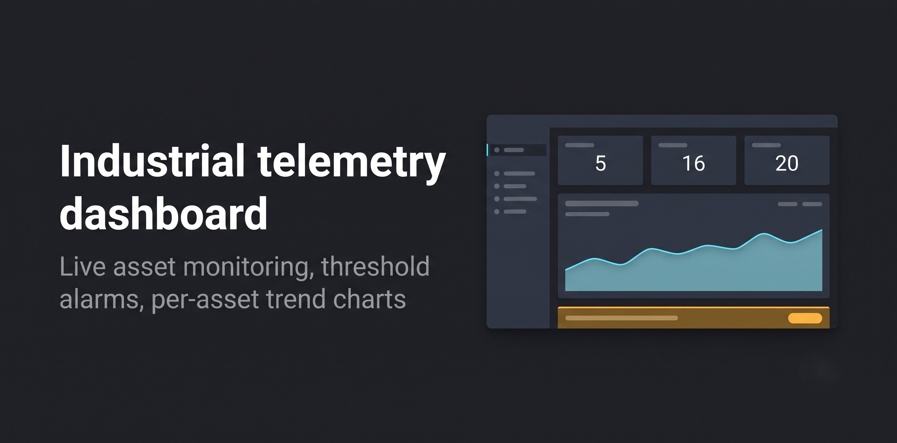
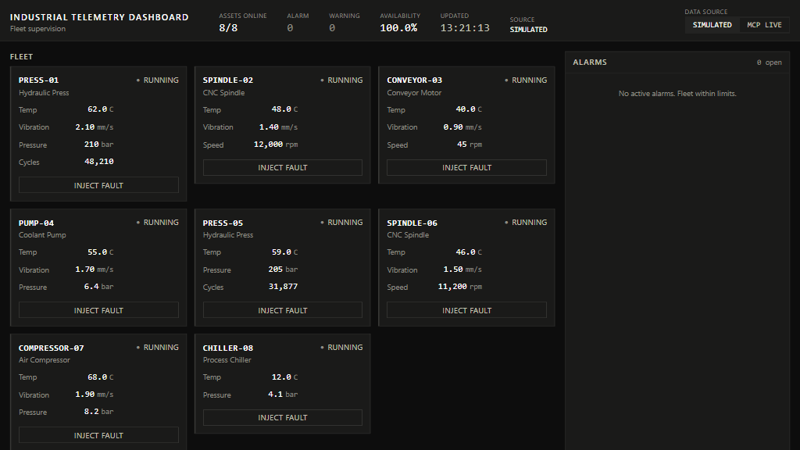
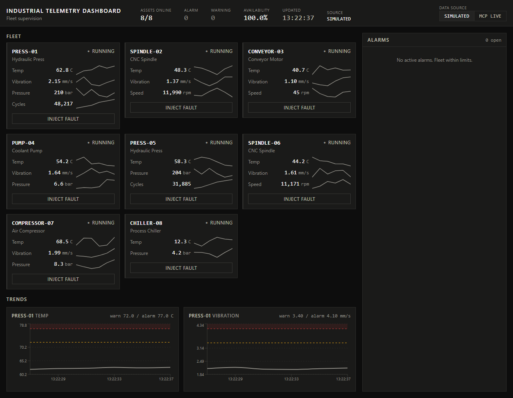
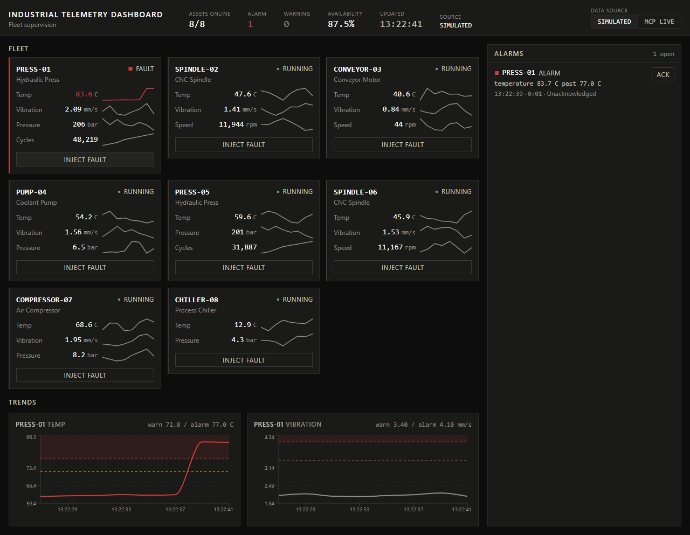
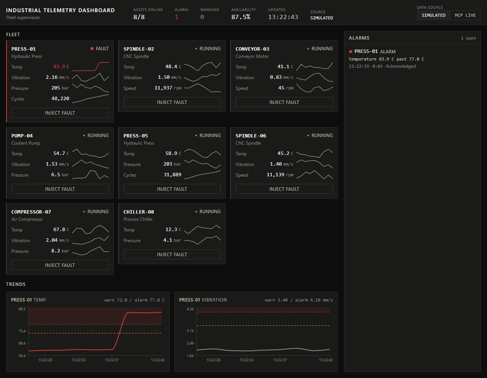
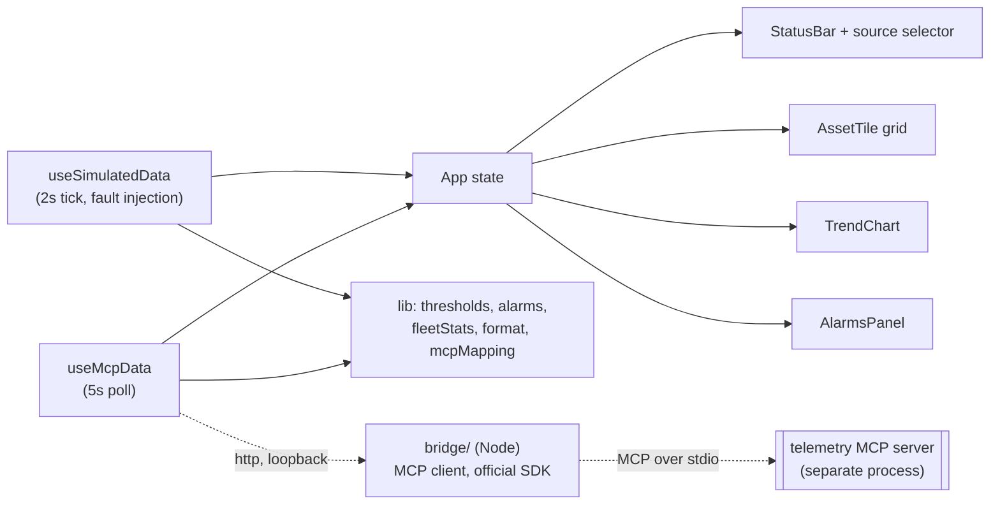

# Industrial Telemetry Dashboard

> A supervision screen for a fleet of industrial machines: live readings against operating limits, threshold driven alarms with a real lifecycle, and a self contained data simulator so it runs with one command.

[](https://github.com/Younes-Alaoui-Ismaili/Industrial-telemetry-dashboard/actions/workflows/ci.yml)


**[Live demo](https://younes-alaoui-ismaili.github.io/Industrial-telemetry-dashboard/)**



72 seconds, real time, no cuts and no speed up: a healthy fleet, a fault injected on `PRESS-01`, the alarm raised on the next tick and climbing, the acknowledgement, then the return to normal when the 30 second fault window closes. Captured from the production build by `npm run capture`, one frame per simulator tick.

Eight machines report temperature, vibration, pressure, speed and cycle counts. Every reading is compared against its own warning and alarm limits, and any crossing raises an alarm that tracks its own peak, duration and acknowledgement state. An **Inject fault** control on each machine drives a metric past its limit on demand, so the whole path from healthy fleet to raised alarm to acknowledgement can be demonstrated in about a minute.

## Data sources

A selector in the header chooses where the readings come from.

- **Simulated** (default). The built in simulator. Nothing to install, nothing to configure, and it is what the live demo above runs on.
- **MCP live**. Real readings from a telemetry [MCP](https://modelcontextprotocol.io) server, reached through a small local bridge. The dashboard calls the server's own tools: `list_devices`, `get_telemetry`, `get_anomalies` and `simulate_fault`. Alarms in this mode are the ones the server detected, carrying the threshold the server itself crossed. Injecting a fault sends `simulate_fault` to the server and the readings move because the server moved them.

> **MCP live works on your machine, not on the published demo.** The demo page is served over `https`, and a page served over `https` is not allowed to call `http://localhost`. That is browser mixed content policy and there is no way around it from a static site. Selecting **MCP live** on the published demo will always report the server as unavailable. To see it work, clone the repository and run it locally.

### Honest degradation

If the server or the bridge is not running, the dashboard does not pretend. It shows a banner naming the failure, states in words that what is on screen is simulated, and marks the header source as `SIMULATED (FALLBACK)`. Simulated readings are never presented as live ones.

### Running the live mode

The bridge is a separate Node package in `bridge/`. It speaks MCP over stdio to the telemetry server using the official [`@modelcontextprotocol/sdk`](https://github.com/modelcontextprotocol/typescript-sdk), and exposes what it gets on loopback so the browser can read it.

```bash
cd bridge
npm ci
cp .env.example .env      # then point TELEMETRY_MCP_ARGS at your telemetry server
node --env-file=.env src/index.js
```

The bridge refuses to start without `TELEMETRY_MCP_COMMAND`, rather than guessing a path and reporting a connection failure that is really a configuration failure. No machine specific path is stored in this repository.

With the bridge running, start the dashboard as usual and pick **MCP live** in the header.

## Design

The screen follows the conventions of high performance industrial supervision rather than general purpose dashboard styling:

- **Neutral until abnormal.** Normal operation is rendered in desaturated greys. Colour is spent only on warning and alarm states, so an excursion is the only coloured thing on screen. There is deliberately no per metric colour coding and no "healthy green".
- **State is never colour alone.** Every state carries a written label and a distinct shape as well as a colour, which keeps it readable with colour vision deficiency, on a washed out panel, and in print.
- **Limits are drawn on the trends.** A bare curve says a number moved; a curve with its warning line, alarm line and exceedance band says whether that matters.
- **Stable numerals.** Readings use tabular figures with a fixed number of decimals, so digits do not shift as values update. No web fonts are loaded.
- **Density over decoration.** Sharp borders and tight spacing instead of large rounded cards, no 3D, no gauges, no decorative iconography, and no animation on normal states.

Contrast is held to WCAG AA mechanically: `src/lib/contrast.test.ts` computes the ratio for every ink and surface pair and fails the build if any text pair drops below 4.5:1.

## Screenshots

Full page captures of the production build, taken by the same pipeline as the animation above. The animation is cropped to the fold; these show the trend panel underneath it.

**Healthy fleet.** Desaturated throughout, no colour anywhere, which is what makes an excursion impossible to miss.



**Alarm raised.** `PRESS-01` past its temperature limit: the tile carries a written state and a shaped indicator as well as colour, the trend draws the warning line, the alarm line and the exceedance band, and the alarm row states the peak and the threshold it crossed.



**Acknowledged.** Acknowledging is a state transition, not a deletion: the alarm stays on the list until it has both cleared and been acknowledged.



## Features

- **Two data sources**: the built in simulator, and live readings from a telemetry MCP server through a local bridge, behind one selector and one component contract.
- **Fleet grid**: eight machines with plant style tags, each showing state, live readings with units, and a micro trend.
- **Status bar**: assets online, open alarms by severity, availability, and the time of the last update.
- **Alarm lifecycle**: alarms are raised by threshold crossings and move through unacknowledged, acknowledged, and returned to normal but unacknowledged. Acknowledging is a state transition, never a deletion, so an alarm stays visible until it has both cleared and been acknowledged.
- **Fault injection**: force a metric past its alarm limit for a bounded window to demonstrate the alarm path end to end.
- **Audit trail**: acknowledgements and injections are recorded with timestamps.
- **Typed domain model**: assets, metric specifications with limits and units, alarms and audit entries.

## Architecture

The dashboard is client side. Two hooks expose the same return shape, so the components never learn which source they are rendering; all decision logic lives in pure modules that are unit tested without rendering. Only the live mode reaches outside the browser, and it does so through a Node process that keeps the MCP client out of the bundle entirely.



- `src/constants/fleet.ts`: the machines, their metrics, and their operating limits.
- `src/constants/theme.ts`: the palette, mirrored in the Tailwind config and guarded against drift by a test.
- `src/lib/`: pure logic. Threshold evaluation, the alarm lifecycle, fleet rollups, number formatting, contrast maths, and the translation from the server's wire shapes into the domain model.
- `src/hooks/useSimulatedData.ts`: owns live values, rolling history and alarms, and advances them on a fixed tick.
- `src/hooks/useMcpData.ts`: polls the bridge and reports its own connection state. Holds no data when the server is unreachable.
- `src/components/Dashboard/`: presentational components.
- `bridge/`: the Node side. `session.js` owns the MCP client, `telemetry.js` assembles the tool calls, `api.js` is the routing table as a pure function, `server.js` is the loopback listener.

Nothing is added to the browser bundle for the live mode: the MCP SDK is a dependency of `bridge/`, which is a Node process, and the dashboard talks to it with `fetch`.

## Tech stack

- **Framework**: React 18 + TypeScript
- **Build tool**: Vite 5
- **Styling**: Tailwind CSS 3
- **Charts**: Recharts
- **Tests**: Vitest + Testing Library

## Getting started

Requirements: Node.js 18+ and npm.

```bash
# install exact dependencies
npm ci

# start the dev server
npm run dev

# production build
npm run build

# preview the production build
npm run preview
```

Then open the URL printed by Vite (default `http://localhost:5173`).

## Development

```bash
npm test        # run the test suite
npm run test:cov # run it with coverage
npm run lint    # eslint
```

The suite runs as two projects: `app` for the browser code under jsdom, and `bridge` for the Node code. Run `npm ci` inside `bridge/` once so the bridge project can resolve its dependencies. Bridge tests drive a fake child process with a real SDK server on the far end of an in memory pipe: no process is spawned and no socket is opened.

Continuous integration runs lint, type check, tests and build on every push and pull request.

### Regenerating the README media

```bash
npm run build                              # the capture serves dist/, not the dev server
npx playwright-core install chromium       # one time, downloads the browser
npm run capture                            # both the GIF and the screenshots
```

`scripts/capture.mjs` starts `vite preview`, drives the scenario in Chromium, and writes `docs/demo.gif` and `docs/screenshots/`. The encoder is pure JavaScript (`gifenc`, with `pngjs` to read the frames back), so there is no ffmpeg and nothing on PATH to install. Capture runs at one frame per 2000 ms simulator tick, plus one extra frame after each click: the trend animation is disabled and the only CSS transition is a button hover, so a higher rate would only write duplicate frames into the file. Pass `gif` or `stills` as an argument to run a single pass.

## Roadmap

- Persist fleet configuration and limits instead of defining them in code.
- Add per asset detail views for longer history windows.
- Reconcile the two fleets: the live source reports the four machines the telemetry server exposes, the simulator carries eight.

## License

Released under the [MIT License](LICENSE).
