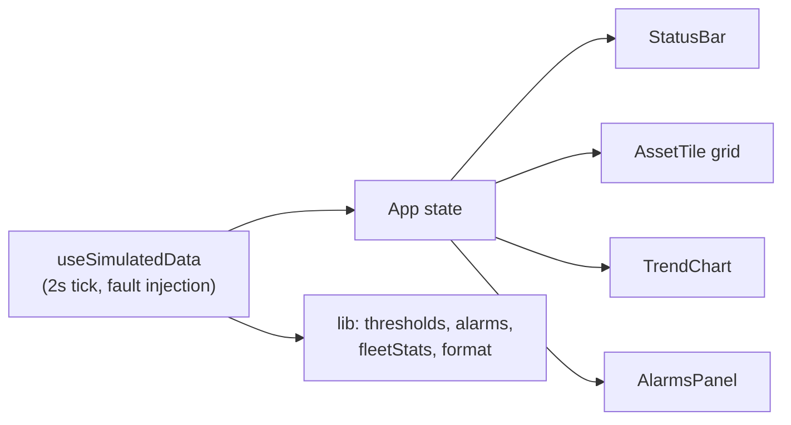

# Industrial Telemetry Dashboard

> A supervision screen for a fleet of industrial machines: live readings against operating limits, threshold driven alarms with a real lifecycle, and a self contained data simulator so it runs with one command.

[](https://github.com/Younes-Alaoui-Ismaili/Industrial-telemetry-dashboard/actions/workflows/ci.yml)


**[Live demo](https://younes-alaoui-ismaili.github.io/Industrial-telemetry-dashboard/)**

Eight machines report temperature, vibration, pressure, speed and cycle counts. Every reading is compared against its own warning and alarm limits, and any crossing raises an alarm that tracks its own peak, duration and acknowledgement state. An **Inject fault** control on each machine drives a metric past its limit on demand, so the whole path from healthy fleet to raised alarm to acknowledgement can be demonstrated in about a minute.

## Design

The screen follows the conventions of high performance industrial supervision rather than general purpose dashboard styling:

- **Neutral until abnormal.** Normal operation is rendered in desaturated greys. Colour is spent only on warning and alarm states, so an excursion is the only coloured thing on screen. There is deliberately no per metric colour coding and no "healthy green".
- **State is never colour alone.** Every state carries a written label and a distinct shape as well as a colour, which keeps it readable with colour vision deficiency, on a washed out panel, and in print.
- **Limits are drawn on the trends.** A bare curve says a number moved; a curve with its warning line, alarm line and exceedance band says whether that matters.
- **Stable numerals.** Readings use tabular figures with a fixed number of decimals, so digits do not shift as values update. No web fonts are loaded.
- **Density over decoration.** Sharp borders and tight spacing instead of large rounded cards, no 3D, no gauges, no decorative iconography, and no animation on normal states.

Contrast is held to WCAG AA mechanically: `src/lib/contrast.test.ts` computes the ratio for every ink and surface pair and fails the build if any text pair drops below 4.5:1.

## Screenshots

Screenshots are being regenerated for the current interface. The [live demo](https://younes-alaoui-ismaili.github.io/Industrial-telemetry-dashboard/) shows the running dashboard in the meantime.

## Features

- **Fleet grid**: eight machines with plant style tags, each showing state, live readings with units, and a micro trend.
- **Status bar**: assets online, open alarms by severity, availability, and the time of the last update.
- **Alarm lifecycle**: alarms are raised by threshold crossings and move through unacknowledged, acknowledged, and returned to normal but unacknowledged. Acknowledging is a state transition, never a deletion, so an alarm stays visible until it has both cleared and been acknowledged.
- **Fault injection**: force a metric past its alarm limit for a bounded window to demonstrate the alarm path end to end.
- **Audit trail**: acknowledgements and injections are recorded with timestamps.
- **Typed domain model**: assets, metric specifications with limits and units, alarms and audit entries.

## Architecture

Entirely client side. A single hook owns the simulation and pushes state into the component tree; all decision logic lives in pure modules that are unit tested without rendering.



- `src/constants/fleet.ts`: the machines, their metrics, and their operating limits.
- `src/constants/theme.ts`: the palette, mirrored in the Tailwind config and guarded against drift by a test.
- `src/lib/`: pure logic. Threshold evaluation, the alarm lifecycle, fleet rollups, number formatting, and contrast maths.
- `src/hooks/useSimulatedData.ts`: owns live values, rolling history and alarms, and advances them on a fixed tick.
- `src/components/Dashboard/`: presentational components.

## Tech stack

- **Framework**: React 18 + TypeScript
- **Build tool**: Vite 5
- **Styling**: Tailwind CSS 3
- **Charts**: Recharts
- **Tests**: Vitest + Testing Library

## Getting started

Requirements: Node.js 18+ and npm.

```bash
# install exact dependencies
npm ci

# start the dev server
npm run dev

# production build
npm run build

# preview the production build
npm run preview
```

Then open the URL printed by Vite (default `http://localhost:5173`).

## Development

```bash
npm test        # run the test suite
npm run test:cov # run it with coverage
npm run lint    # eslint
```

Continuous integration runs lint, type check, tests and build on every push and pull request.

## Roadmap

- Replace the simulated data layer with a live source, keeping the same component contract.
- Persist fleet configuration and limits instead of defining them in code.
- Add per asset detail views for longer history windows.

## License

Released under the [MIT License](LICENSE).
